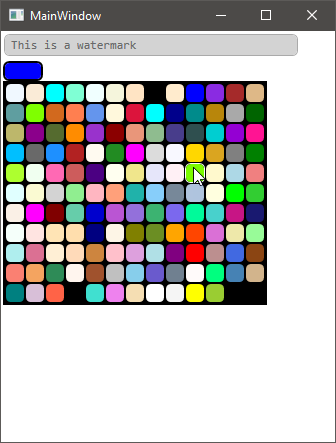
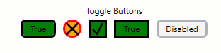
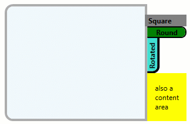

# AgileBIM.Controls
This is a project that was created to consolidate the random controls I've had to make because WPF didn't natively provide them or at least not to the degree I needed them. Your welcome to use them for whatever purpose you want. In many cases these purely expose properties that were obscured by the default templates, which makes your setup a bit more, but very minimalistic compared to what would normally have to be done to access obscured properties.

### Available Controls

- **AgileTextBox** (based on TextBox Control)
  - BorderBrushFocused (Dependency Property/Bindable)
  - BorderRadius (Dependency Property/Bindable)
  - Watermark (Dependency Property/Bindable)
  - WatermarkColor (Dependency Property/Bindable)
  - WatermarkFontFamily (Dependency Property/Bindable)
- **AgileColorPicker** (based on Border Control)
  - SelectedBrush (Dependency Property/Bindable)
  - SelectedColor (Non DP/Non Bindable configured to read/update SelectedBrush)
  - BorderRadius (Integral to the base control)
  - Label (Dependency Property/Bindable)
  - Uses a popup for the selector

The screenshot below are slightly deceptive because the first AgileColorPicker is attached/blended directly to an AgileTextBox, but they are in fact separate controls. The color palette will popup below/centered on the activator, but it was shown off to the side for clarity. Also note that windows will automatically adjust the location of the palette popup around screen edges. You'll also notice that there is an optional integral label that automatically switches its foreground color between white/black depending on which one is more likely to be legible.

- **AgileToggleButton** (based on ToggleButton Control)
  - BorderRadius (Dependency Property/Bindable)
  - BackgroundChecked (Dependency Property/Bindable)
  - BackgroundDisabled (Dependency Property/Bindable)
  - BackgroundHover (Dependency Property/Bindable)
  - BackgroundPressed (Dependency Property/Bindable)
  - BorderBrushChecked (Dependency Property/Bindable)
  - BorderBrushDisabled (Dependency Property/Bindable)
  - BorderBrushHover (Dependency Property/Bindable)
  - BorderBrushPressed (Dependency Property/Bindable)
  - CheckVisibility (Dependency Property/Bindable)

- **AgileButton** (based on Button Control)
  - BorderRadius (Dependency Property/Bindable)
  - BackgroundDisabled (Dependency Property/Bindable)
  - BackgroundHover (Dependency Property/Bindable)
  - BackgroundPressed (Dependency Property/Bindable)
  - BorderBrushDisabled (Dependency Property/Bindable)
  - BorderBrushHover (Dependency Property/Bindable)
  - BorderBrushPressed (Dependency Property/Bindable)
  - Not shown in image below, but has similar property exposures/effects

Not shown in in the image blow, but the AgileButton is a more simple version of the featured AgileToggleButton. The displayed styles are not imbedded on the controls, they are just completely random color values that would provide good contrast of all the state colors that have been exposed. The True/False ones are just binding the Content property to the IsChecked property and the ones with the actual check/x-mark are an optionally visible path for simulating a checkbox; which can be useful since standard checkboxes don't really scale. Note that ToggleButtons do not support 3-State checking.

- **AgileTabControl** (based on TabControl)
  - MarginHeaderPanel (Dependency Property/Bindable)
  - BorderRadius (Dependency Property/Bindable)
  - TabBlankSpaceContent (Dependency Property/Bindable)
- **AgileTabItem** (based on TabItem)
  - TabBackground (Dependency Property/Bindable)
  - TabBackgroundHover (Dependency Property/Bindable)
  - TabBackgroundSelected (Dependency Property/Bindable)
  - TabBorderBrush (Dependency Property/Bindable)
  - TabBorderBrushHover (Dependency Property/Bindable)
  - TabBorderBrushSelected (Dependency Property/Bindable)
  - TabIsRotated (Dependency Property/Bindable)
    - -90 flip of the Tab not the Content
  - TabFontSize (Dependency Property/Bindable)
    - Prevents it from propagating into the children
  - TabFontWeight (Dependency Property/Bindable)
    - Prevents it from propagating into the children
  - TabSelectedMargin (Dependency Property/Bindable)
    - Typically offsets tab towards content to break content border
  - TabBorderRadius (Dependency Property/Bindable)
  - TabBorderThickness (Dependency Property/Bindable)

Again, this demo isn't intended to be pretty, it is just a demonstration of all the various properties that have been unlocked compared to what is typically available. There is nothing preventing you from using AgileTabItem's with a normal TabControl, but I think the ability to position the HeaderPanel and reclaim the space not used by tabs for other content in a controlled way makes the AgileTabControl pretty invaluable. There is also some unique behavior in the way it handles background colors both on the TabControl and of its AgileTabItem children. Basically it lets you set the tab content background per tab instead of on the TabControl. The AgileTabItem is perfectly capable of mixing rotated and non-rotated tabs in the same control, but you should probably make 2 separate styles since margin offsets, border radiuses and alignments would likely need to be different.

