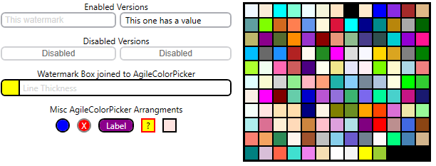

# AgileBIM.Controls
This is a project that was created to consolidate the random controls I've had to make because WPF didn't natively provide them or at least not to the degree I needed them. Your welcome to use them for whatever purpose you want.

### Available Controls

- WatermarkTextBox (based on TextBox Control)
  - FocusedBorderColor (Dependency Property/Bindable)
  - BorderRadius (Dependency Property/Bindable)
  - Watermark (Dependency Property/Bindable)
  - WatermarkFontFamily (Dependency Property/Bindable)
  - WatermarkColor (Dependency Property/Bindable)
- ColorPicker (based on Border Control)
  - SelectedBrush (Dependency Property/Bindable)
  - SelectedColor (Non DP/Non Bindable configured to read/update SelectedBrush)
  - BorderRadius (Dependency Property/Bindable)
  - Uses a popup for the selector
  - Screenshot below shows it attached/blended, to textbox, but is separate control

### Screenshots

